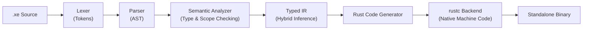

<div align="center">
  
  <h1>The XE Programming Language</h1>
  <p><strong>A fast, indentation-based programming language compiling to standalone native machine code via Rust.</strong></p>

  <p>
    <a href="https://xe-lang.vercel.app">Website</a> •
    <a href="https://xe-lang.vercel.app/docs">Documentation</a> •
    <a href="https://xe-lang.vercel.app/docs/guide/getting-started">Getting Started</a> •
    <a href="https://github.com/v8v88v8v88/XE/releases">Changelog</a> •
    <a href="https://github.com/v8v88v8v88/XE/issues">Issues</a>
  </p>

  <p>
    <a href="https://github.com/v8v88v8v88/XE/releases/latest"></a>
    <a href="https://github.com/v8v88v8v88/XE/actions"></a>
    <a href="https://github.com/v8v88v8v88/XE/blob/main/LICENSE"></a>
    <a href="https://xe-lang.vercel.app"></a>
  </p>
</div>

---

## What is XE?

**XE** is an expressive, indentation-based programming language built for developers who want the clean readability of Python with the execution speed and standalone binary output of native code. 

XE compiles source files directly to optimized Rust, leveraging `rustc` and LLVM for native code generation, zero-overhead memory management, and cross-platform compilation.

```xe
# Quick look at XE syntax
fun fibonacci(n):
    if n <= 1:
        return n
    return fibonacci(n - 1) + fibonacci(n - 2)

fun main():
    limit = 10
    print("Fibonacci sequence up to", limit)
    
    for i in [0, 1, 2, 3, 4, 5, 6, 7, 8, 9, 10]:
        print("fib(" + convert(i, "text") + ") =", fibonacci(i))

main()
```

---

## Key Features

- **Native Performance**: Compiles down to native machine code via Rust with zero interpreter overhead.
- **Pythonic Syntax**: Clean indentation-based block syntax (`fun`, `if`, `elif`, `else`, `while`, `for`, `repeat`).
- **Hybrid Typed IR**: Automatically infers and uses native unboxed types (`f64`, `bool`, `String`, vector slices) for maximum throughput.
- **Multi-File Modules**: Seamless project organization with relative imports (`import math_utils`, `from helpers import format_name`).
- **Lexical Scoping**: Function-local variables, parameter shadowing, and global state management.
- **Rich Diagnostics**: Actionable compiler errors with exact source line snippets and column caret pointers.
- **Built-in CLI**: Single tool for running, compiling, installing, and self-updating.

---

## Installation

### Quick Install (Linux / macOS)

```bash
curl -fsSL https://xe-lang.vercel.app/install.sh | bash
```

To install to a custom directory:
```bash
XE_INSTALL_DIR="$HOME/bin" curl -fsSL https://xe-lang.vercel.app/install.sh | bash
```

### Build from Source

**Prerequisites:** [Rust toolchain](https://rustup.rs/) (`rustc` & `cargo` 1.70+).

```bash
git clone https://github.com/V8V88V8V88/XE.git
cd XE
cargo build --release

# Install binary to ~/.local/bin
./target/release/xe install
```

---

## Quick Start

| Command | Description |
| :--- | :--- |
| `xe run <file.xe>` | Compile and execute an XE program immediately |
| `xe compile <file.xe> -o <binary>` | Build an optimized standalone native binary |
| `xe compile <file.xe>` | Emit generated Rust source code to `stdout` |
| `xe update` | Check for and install the latest compiler release |
| `xe --version` | Display compiler version |

```bash
# Run a single file
xe run examples/hello.xe

# Compile to an optimized binary
xe compile examples/adventure.xe -o adventure
./adventure

# Run a multi-module program
xe run examples/modules/main.xe
```

---

## Architecture & Pipeline



1. **Lexer (`lexer.rs`)**: Scans tokens, indentation levels, and source spans.
2. **Parser (`parser.rs`)**: Validates grammar and builds the Abstract Syntax Tree (AST).
3. **Semantic Analyzer (`semantic.rs`)**: Enforces variable definitions, module boundaries, and control flow rules.
4. **Compiler Linker (`compiler.rs`)**: Resolves module dependency graphs and rewrites lexical scopes.
5. **Codegen (`codegen.rs`)**: Infers native types and generates optimized Rust prelude and functions.
6. **Backend (`rustc`)**: Compiles generated Rust directly to native platform binaries.

---

## Language Overview

### Variables & Data Types
```xe
name = "XE"           # Text (String)
version = 0.1         # Number (f64)
is_fast = true        # Boolean (bool)
items = [1, 2, 3, 4]  # List
```

### Control Flow
```xe
# If / Elif / Else
if score >= 90:
    print("Grade: A")
elif score >= 80:
    print("Grade: B")
else:
    print("Grade: C")

# For Loops (Lists & Strings)
for item in [10, 20, 30]:
    print(item)

for ch in "XE":
    print(ch)

# While & Repeat Loops
while count > 0:
    count = count - 1

repeat 5 times:
    print("Hello!")
```

### Functions & Modules
```xe
# File: math_utils.xe
fun square(x):
    return x * x

# File: main.xe
from math_utils import square

print("5 squared is", square(5))
```

---

## Performance Benchmark

A reproducible benchmark comparing XE with CPython on a recursive Fibonacci workload:

```bash
python3 examples/benchmark.py
```

Because XE compiles down to native machine code via `rustc`, recursive and computational algorithms run with native CPU speed.

---

## Testing

```bash
# Run the full automated test suite (75 tests)
cargo test

# Run linter checks
cargo clippy --all-targets --all-features
```

To view or build the documentation locally:
```bash
cd docs
npm install
npm run docs:dev
```

---

## Roadmap

- [x] Multi-file module dependency resolver & linker
- [x] Hybrid Typed IR with native unboxed type inference
- [x] Global & local lexical scope shadowing
- [x] Formatted compiler error diagnostics with source carets
- [ ] First-class closures and lambda expressions
- [ ] Standard library expansion (File I/O, OS, Math)
- [ ] User-defined structs / records
- [ ] Language Server Protocol (LSP) and VS Code Extension

---

## License

This project is licensed under the **GPL-3.0-or-later** license. See the [LICENSE](LICENSE) file for details.
