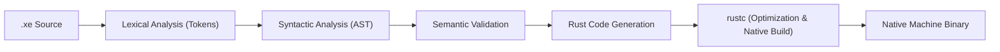

<div align="center">


# XE Programming Language
</div>

XE is a small programming language that compiles into Rust source code and then into a native executable through `rustc`. Its syntax is indentation-based and intentionally compact so the compiler pipeline stays easy to study.

This is a hobby and learning project. Do not use it in production. It is meant for people who want to see how a simple language and compiler are built.

---

## What is XE?

XE is a **source-to-source** language. That means:

1. You write a `.xe` file (XE source code).
2. The XE compiler reads it and outputs Rust source code.
3. You (or the tooling) run the Rust compiler on that code to get an executable.

So XE does not run your code directly. It translates it to Rust and lets Rust handle the final native build. You get:

- **Simple syntax** – English-like, Python-style, so it is easy to read.
- **Native build output** – XE can produce a standalone executable through Rust.
- **A compact compiler codebase** – lexer, parser, semantic checks, and code generation are all easy to inspect.

---

## Why XE?

XE is primarily a compiler project:

- It gives you a small language to experiment with.
- It shows a complete frontend-to-codegen pipeline.
- It produces native binaries instead of interpreting the source directly.

The main goal is clarity and implementation quality, not feature count.

---

## Benefits

- **Readable syntax** – indentation-based and easy to follow in examples.
- **Native executables** – XE uses `rustc` to build platform binaries.
- **Clear structure** – lexer, parser, semantic analysis, and code generation are separated cleanly.
- **Useful diagnostics** – compiler errors include line/column context and a caret marker.
- **Multi-file programs** – XE modules can import other XE files and compile into one native binary.
- **Good for learning** – the codebase is small enough to understand without a large framework.

---

## How it works (the pipeline)

When you run the XE compiler on your source, it follows this transformation process:



1. **Lexer** – Splits your source code into tokens (words, numbers, symbols).
2. **Parser** – Checks that the tokens form valid sentences (syntax) and builds a tree (AST).
3. **AST (Abstract Syntax Tree)** – A tree that represents the structure of your program.
4. **Semantic validation** – Checks names, function calls, loop control, and other structural rules.
5. **Rust code generator** – Writes safe Rust code that does what your XE program says.
6. **Rust compiler (rustc)** – Compiles that Rust code into an executable.

So: XE source → Lexer → Parser → AST → Semantic check → Rust code → rustc → executable.

---

## Documentation

The project now uses a standard docs site inside `docs/`:

- **Main entry:** `docs/index.md`
- **Guides:** Getting started, Language basics, Examples.
- **References:** CLI, Language, Status.

You can run the docs locally:

```bash
cd docs
npm install
npm run docs:dev
```

*(You can also build the docs using `npm run docs:build`.)*

---

## Getting Started

### 1. Prerequisites
You must have the **[Rust toolchain](https://rustup.rs/)** (`cargo` and `rustc`) installed.

### 2. Build the Compiler
```bash
git clone https://github.com/V8V88V8V88/XE.git
cd XE
cargo build --release
```
The compiler binary will be created in Cargo's release output directory.

To install that built binary into `~/.local/bin`, run:

```bash
./target/release/xe install
```

If `~/.local/bin` is not already in your `PATH`, add it before using `xe` directly.

*Note: For macOS users, follow the same steps above to build a native binary for Apple Silicon or Intel Macs.*

---

## Usage

### Run an XE program
Compiles and executes the program in one step.
```bash
xe run examples/hello.xe
```

### Compile to a Native Binary
Produces a standalone executable.
```bash
xe compile examples/hello.xe -o hello
./hello
```

### Print the Generated Rust
Emits the Rust source XE generates to standard output.
```bash
xe compile examples/hello.xe
```

### Run a Multi-File XE Program
Imports are resolved relative to the importing `.xe` file, and both `run` and `compile` link the full XE module graph before generating Rust.
```bash
xe run examples/modules/main.xe
```

---

## Benchmark

The repository includes a reproducible benchmark that compares XE with CPython on the same recursive Fibonacci workload:

```bash
python3 examples/benchmark.py
```

The script:

- builds the XE compiler in release mode if needed
- compiles `examples/benchmark.xe` into a native binary
- runs both implementations multiple times
- prints the mean runtime and the Python/XE speedup ratio

Use the script output for screenshots or performance notes, because the exact numbers depend on your machine.

---

## Verification

To run the full automated compiler and CLI test suite:

```bash
cargo test -- --nocapture
```

At the time of writing, this runs **58 automated tests** covering parsing, imports, control flow, functions, runtime errors, binary generation, and installer behavior.

You can also verify the documentation build with:

```bash
cd docs
npm install
npm run docs:build
```

---

## What you can write in XE

**Data types**

- **Number** – Integers and decimals.
- **Text** – Strings.
- **Boolean** – True and false.
- **List** – An ordered list of values.

XE uses an **inferred type system** with a **Typed IR**. The compiler tries to map variables to native Rust types (`f64`, `bool`, `String`) for performance, falling back to a dynamic `XeValue` box only when types are mixed or unknown.

**Control flow**

- `if` / `elif` / `else` – Branch on a condition.
- `repeat N times` – Loop a fixed number of times.
- `while` – Loop while a condition stays true.
- `for item in iterable` – Iterate over lists and text.
- `break` / `continue` – Control loop execution.

**Functions**

You can define functions, e.g.:

```xe
fun greet(name):
    print("Hello " + name)
```

Functions can access their parameters, local variables, and **global module-level variables**. They do not yet support nested closures (capturing locals from an outer function).

**Modules**

XE can split code across multiple files:

```xe
from math_utils import double
print(double(21))
```

Current module rules:

- `import module_name` loads another `.xe` file and brings its top-level functions into scope.
- `from module_name import name` imports selected top-level functions.
- imports are resolved relative to the importing file.
- imports must appear before executable top-level statements.
- imported module top-level code runs once before the entry module starts executing.

**Built-in functions**

- `print()` – Print to the screen.
- `input()` – Read input from the user.
- `length()` – Length of text or a list.
- `type()` – Get the type of a value.
- `convert()` – Convert between `number`, `text`, and `boolean`.

---

## Example programs

**Hello World**

```xe
print("Hello, World!")
```

**Numbers**

```xe
x = 10
y = 20
print(x + y)
```

**Conditional**

```xe
age = input("Enter age: ")
age = convert(age, "number")
if age >= 18:
    print("Adult")
elif age >= 13:
    print("Teen")
else:
    print("Minor")
```

**Interactive To-Do List**

```xe
tasks = []
running = true
while running:
    print("You have " + convert(length(tasks), "text") + " task(s)")
    item = input("Add task (or 'q' to quit): ")
    if item == "q":
        running = false
    else:
        tasks = tasks + [item]
```

**Text Adventure Game**

```xe
print("You are in a dark forest.")
choice = input("Go North or South? ")
if choice == "North":
    print("You found a treasure!")
else:
    print("You were eaten by a grue.")
```

---

## What XE does *not* do (for now)

- The feature set is small on purpose.
- No concurrency (no threads, async, etc.).
- No networking or file I/O in the language yet.
- No nested closures yet; functions cannot capture local variables from an outer function.
- The focus is on doing things correctly, not on fancy optimizations.

Possible future steps: better optimizations (e.g. bytecode or IR), more built-ins, a formatter, debugger, or IDE support.

---

## What you need to run XE

- **Hardware** – A normal computer (e.g. 4 GB RAM or more).
- **Software** – Rust toolchain (so you can compile the generated Rust code), and Git if you clone the repo.

---

## Project Status

**Current Version:** 0.1.3 pre-alpha

The XE compiler is currently in its **Pre-Alpha** stage. The core pipeline works and is covered by integration tests, but the project is still a research prototype.

Recent milestone work completed:

- **Fixed binary expression codegen**: Arithmetic between dynamic and native types now compiles correctly.
- **Fixed assignment double-evaluation**: Side-effectful expressions in module-level assignments (like `input()`) now execute only once.
- **Hybrid Typed IR**: Improved performance by inferring and using native Rust types where possible.
- **Global Variable Access**: Functions can now correctly read and write global variables using a thread-local registry.
- fixed assignment semantics for reassignment across nested blocks
- added `elif`, `while`, `for`, `break`, and `continue`
- replaced silent runtime fallbacks with explicit runtime errors
- improved compiler errors with source snippets and carets
- added GitHub Actions CI
- expanded integration tests and aligned the docs/CLI with the current implementation

---

## License

This project is licensed under GPL-3.0-or-later - see the [LICENSE](LICENSE) file for details.
